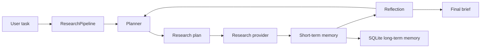

# auto-research

An auto-research pipeline scaffold for coding agents. It gives an agent the
basic loop it needs to research a task, keep memory, plan work, reflect on
progress, and emit a final research brief.

## What It Supports

- Short-term memory for the current run.
- Long-term memory persisted in SQLite.
- Classical retrieval with BM25-style lexical scoring, recency and importance
  boosts, tag/kind/scope filters, and token-overlap diversification.
- Planning with explicit research steps and success criteria.
- Dependency-aware plans that can be linear, tree-like, or graph-like.
- Checkpointed long-running research runs that can be resumed one step at a time.
- Human-in-the-loop checkpoints for approvals, clarifications, decisions, and risk reviews.
- Deterministic prompt assembly with fixed cached layers and per-round variable layers.
- Deterministic verification for correctness, completeness, and integrity.
- Reflection after each step to identify gaps and next actions.
- A provider interface for plugging in real LLM/search/coding-agent backends.
- A CLI that works out of the box with deterministic local providers.

## Quick Start

```bash
python3 -m venv .venv
source .venv/bin/activate
pip install -e ".[dev]"
auto-research "How should a coding agent research and implement a CLI feature?"
```

The default run uses local heuristic providers, so no API key is required.

## CLI

```bash
auto-research "Research prompt" --db .auto_research/memory.sqlite --max-steps 4
```

Useful options:

- `--db`: SQLite path for long-term memory.
- `--max-steps`: Maximum research iterations.
- `--session-id`: Optional stable session id.
- `--json`: Print a structured JSON report.

You can also use explicit subcommands:

```bash
auto-research run "Research prompt"
auto-research improve --repo .
auto-research memory remember "Prefer BM25 retrieval before embeddings" --scope procedural --tag retrieval
auto-research memory search "BM25 retrieval" --scope procedural
auto-research memory consolidate
auto-research runs start "Research a large implementation" --max-steps 12
auto-research runs step <run-id> --steps 3
auto-research runs status <run-id>
auto-research runs brief <run-id>
auto-research human request <run-id> --kind approval --prompt "Approve the next experiment?"
auto-research human respond <run-id> --decision approve --content "Approved; keep the first run small."
```

`improve` writes `.auto_research/improvement_brief.md`, combining a repository
snapshot with the pipeline's plan, observations, and reflection. This gives a
coding agent a repeatable way to decide the next small improvement, implement it,
test it, and run the loop again.

## Coding-Agent Skill

This repo includes a skill bundle at `skills/auto-research`. A coding agent can
load that skill to use the package as an external research loop:

```bash
auto-research improve --repo .
auto-research run "Research how to implement the current coding task"
```

The skill keeps local long-term memory under `.auto_research/memory.sqlite`,
which is intentionally ignored by git.

To make future Codex sessions naturally discover the skill, install it into the
user-level skills directory:

```bash
rm -rf ~/.codex/skills/auto-research
mkdir -p ~/.codex/skills
cp -R skills/auto-research ~/.codex/skills/auto-research
```

If the CLI is not on `PATH`, either activate this repo's virtualenv or create a
small shim to `.venv/bin/auto-research`. New Codex sessions will pick up the
skill metadata after the skill is installed.

For deeper agent guidance, see
`skills/auto-research/references/memory_planning.md`.

## Architecture



The default pipeline is intentionally small:

1. Load relevant long-term memories.
2. Create an initial plan.
3. Retrieve relevant scoped memories without embeddings.
4. Execute dependency-ready research steps through a provider.
5. Store observations in short- and long-term memory.
6. Reflect on gaps, confidence, and next actions.
7. Produce a final report.

## Long-Running Runs

One-shot `run` is useful for short tasks, but real coding-agent research often
outlives one process. A long-running run stores checkpoints under
`.auto_research/runs`:

```bash
auto-research runs start "Investigate and implement a durable agent workflow" --max-steps 12
auto-research runs list
auto-research runs step <run-id>
auto-research runs status <run-id>
```

Each `step` executes one dependency-ready plan node, stores observations and
reflection in memory, then saves the run state. If the process stops, the agent
can load the same run id and continue.

For coding agents, `runs brief` is the main equipment view:

```bash
auto-research runs brief <run-id>
```

It shows run status, the next recommended action, plan progress, recent events,
reflection, and gaps. Use it at the beginning of a work interval to recover
context without loading the entire run history.

Runs also keep an event log. Events record starts, completions, reflections,
budget stops, retries, waits, and failures. This makes the run auditable and
gives future memory consolidation better raw material.

Each checkpointed step also assembles a model-view prompt file. The prompt uses
stable fixed layers first, then variable per-round layers:

- Fixed: role profile, task specification, output format.
- Variable: reference injection, plan, memory recall, human context, state context.

For `runs step`, prompt files are written under
`.auto_research/runs/prompts/<run-id>/` by default. This keeps full prompt
content out of the orchestrator's immediate context while preserving an auditable
artifact for subagents or external executors.

### Human-In-The-Loop Checkpoints

Use `human request` when a run needs explicit human judgment before continuing:

```bash
auto-research human request <run-id> \
  --kind risk_review \
  --prompt "Review whether this benchmark is meaningful before spending more compute."
auto-research human status <run-id>
auto-research human respond <run-id> \
  --decision revise \
  --content "Use a smaller synthetic baseline first, then revisit the full dataset."
```

Open reviews move the run to `needs_human`. Responses are archived as memory and
injected into later prompt files through the human context layer. `approve`,
`revise`, and `comment` resume the run as `active`; `reject` leaves it waiting
for replanning.

Current limitations:

- Checkpoints are local JSON files, not a distributed job queue.
- There is no scheduler or heartbeat loop yet; another process must call
  `runs step`.
- External waits and browser jobs are represented only as waiting state, not
  first-class blocking events.
- Budgets, deadlines, cancellation, and retry policies are not yet modeled.
- Provider calls are synchronous; async providers will need a richer executor.

## Agent Equipment Pattern

A coding agent can treat this repo as a small workbench:

1. `runs start` creates the task file.
2. `runs brief` restores situational awareness.
3. `runs step --steps N` advances research during the current work interval.
4. `memory search` retrieves reusable project knowledge.
5. Normal coding tools implement the selected change.
6. Tests validate it.
7. `memory consolidate` turns reusable lessons into durable memory.

## Reproductions

This repo can also host paper reproduction work created through the
auto-research loop.

- `reproductions/ts_dfm_2511_17229`: scaffold for arXiv:2511.17229,
  "Generating transition states of chemical reactions via
  distance-geometry-based flow matching".

Run its synthetic smoke path with:

```bash
pip install -e ".[ts-dfm,dev]"
reproduce-tsdfm make-synthetic --output reproductions/ts_dfm_2511_17229/data/synthetic.jsonl
reproduce-tsdfm train --config reproductions/ts_dfm_2511_17229/configs/smoke.yaml
reproduce-tsdfm eval --config reproductions/ts_dfm_2511_17229/configs/smoke.yaml
```

## Goal Loop

The pipeline follows a persistent orchestrator loop:

1. Planner creates direction, objectives, dependencies, and retrieval hints.
2. Recall retrieves scoped memory with classical ranking.
3. Context assembler writes a deterministic prompt artifact.
4. Executor runs the step and returns a focused observation.
5. Review records reflection and gaps.
6. Verifier deterministically checks correctness, completeness, and integrity.
7. Archive stores observations, reflections, verification records, and reusable feedback.

If verification fails, the run moves to `waiting` so the agent can inspect the
brief, adjust the plan or executor, and resume.

## Coding-Agent Bridge

No model API is required. `auto-research` can hand work to the current coding
agent through files:

```bash
auto-research runs start "Implement or research the task" --max-steps 8
auto-research agent next <run-id>
# The coding agent reads the printed prompt file and performs the work.
auto-research agent complete <run-id> --step-id <step-id> --observation-file observation.md
auto-research runs brief <run-id>
```

In this mode, `auto-research` is the orchestrator: it owns memory, planning,
prompt assembly, checkpointing, verification, and archiving. The current coding
agent is the executor: it reads the prompt artifact, uses built-in tools, and
returns an observation. This is the preferred no-API path.

## Memory Design

Memory is organized by scope:

- `working`: active facts for the current reasoning window.
- `episodic`: observations from prior runs.
- `semantic`: durable facts and project knowledge.
- `procedural`: reusable methods, policies, and workflows.
- `reflective`: lessons, risks, and post-run conclusions.

Retrieval intentionally avoids embeddings. The default retriever combines:

- BM25-style lexical ranking for exact and near-exact term evidence.
- Scope, kind, and tag filters for precision.
- Importance and recency boosts for salience.
- Token-overlap diversification so one repeated memory does not crowd out the
  rest of the context.

Reusable memories can be promoted with `auto-research memory consolidate`.
Consolidation scans recent episodic and reflective records, then promotes useful
patterns into semantic, procedural, or reflective memory. This keeps raw run
history separate from durable knowledge.

## Planning Design

Small known tasks can use a linear plan. Build tasks generally use a tree-like
decomposition. Research and architecture tasks use a graph-like plan, because
evidence gathering, strategy selection, synthesis, validation, and reflection
often depend on each other without being a single straight line.

Plans are linted for missing goals, missing success criteria, bad edges, and
dependency cycles. Lint findings are stored as reflective memory so future runs
can learn from planning mistakes.

## Extending

Implement these protocols in `auto_research.providers`:

- `ResearchProvider`: fetches or generates observations for a plan step.
- `PlanningProvider`: produces a plan from task and memory context.
- `ReflectionProvider`: evaluates whether the run has enough evidence.

That lets you wire the package to real search APIs, OpenAI models, browser
automation, repository analysis tools, or a coding-agent execution loop without
changing the orchestration code.
