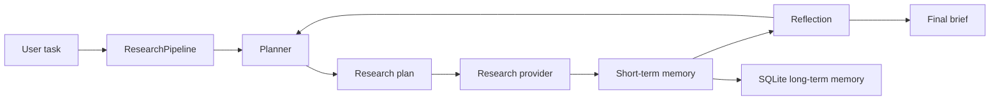

# auto-research

An auto-research pipeline scaffold for coding agents. It gives an agent the
basic loop it needs to research a task, keep memory, plan work, reflect on
progress, and emit a final research brief.

## What It Supports

- Short-term memory for the current run.
- Long-term memory persisted in SQLite.
- Classical retrieval with BM25-style lexical scoring, recency and importance
  boosts, tag/kind/scope filters, and token-overlap diversification.
- Planning with explicit research steps and success criteria.
- Dependency-aware plans that can be linear, tree-like, or graph-like.
- Reflection after each step to identify gaps and next actions.
- A provider interface for plugging in real LLM/search/coding-agent backends.
- A CLI that works out of the box with deterministic local providers.

## Quick Start

```bash
python3 -m venv .venv
source .venv/bin/activate
pip install -e ".[dev]"
auto-research "How should a coding agent research and implement a CLI feature?"
```

The default run uses local heuristic providers, so no API key is required.

## CLI

```bash
auto-research "Research prompt" --db .auto_research/memory.sqlite --max-steps 4
```

Useful options:

- `--db`: SQLite path for long-term memory.
- `--max-steps`: Maximum research iterations.
- `--session-id`: Optional stable session id.
- `--json`: Print a structured JSON report.

You can also use explicit subcommands:

```bash
auto-research run "Research prompt"
auto-research improve --repo .
```

`improve` writes `.auto_research/improvement_brief.md`, combining a repository
snapshot with the pipeline's plan, observations, and reflection. This gives a
coding agent a repeatable way to decide the next small improvement, implement it,
test it, and run the loop again.

## Coding-Agent Skill

This repo includes a skill bundle at `skills/auto-research`. A coding agent can
load that skill to use the package as an external research loop:

```bash
auto-research improve --repo .
auto-research run "Research how to implement the current coding task"
```

The skill keeps local long-term memory under `.auto_research/memory.sqlite`,
which is intentionally ignored by git.

For deeper agent guidance, see
`skills/auto-research/references/memory_planning.md`.

## Architecture



The default pipeline is intentionally small:

1. Load relevant long-term memories.
2. Create an initial plan.
3. Retrieve relevant scoped memories without embeddings.
4. Execute dependency-ready research steps through a provider.
5. Store observations in short- and long-term memory.
6. Reflect on gaps, confidence, and next actions.
7. Produce a final report.

## Memory Design

Memory is organized by scope:

- `working`: active facts for the current reasoning window.
- `episodic`: observations from prior runs.
- `semantic`: durable facts and project knowledge.
- `procedural`: reusable methods, policies, and workflows.
- `reflective`: lessons, risks, and post-run conclusions.

Retrieval intentionally avoids embeddings. The default retriever combines:

- BM25-style lexical ranking for exact and near-exact term evidence.
- Scope, kind, and tag filters for precision.
- Importance and recency boosts for salience.
- Token-overlap diversification so one repeated memory does not crowd out the
  rest of the context.

## Planning Design

Small known tasks can use a linear plan. Build tasks generally use a tree-like
decomposition. Research and architecture tasks use a graph-like plan, because
evidence gathering, strategy selection, synthesis, validation, and reflection
often depend on each other without being a single straight line.

## Extending

Implement these protocols in `auto_research.providers`:

- `ResearchProvider`: fetches or generates observations for a plan step.
- `PlanningProvider`: produces a plan from task and memory context.
- `ReflectionProvider`: evaluates whether the run has enough evidence.

That lets you wire the package to real search APIs, OpenAI models, browser
automation, repository analysis tools, or a coding-agent execution loop without
changing the orchestration code.
