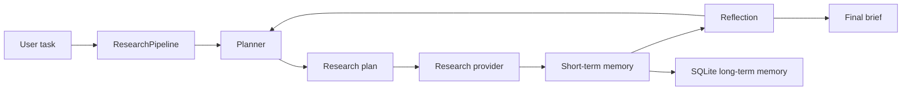

# auto-research

An auto-research pipeline scaffold for coding agents. It gives an agent the
basic loop it needs to research a task, keep memory, plan work, reflect on
progress, and emit a final research brief.

## What It Supports

- Short-term memory for the current run.
- Long-term memory persisted in SQLite.
- Planning with explicit research steps and success criteria.
- Reflection after each step to identify gaps and next actions.
- A provider interface for plugging in real LLM/search/coding-agent backends.
- A CLI that works out of the box with deterministic local providers.

## Quick Start

```bash
python3 -m venv .venv
source .venv/bin/activate
pip install -e ".[dev]"
auto-research "How should a coding agent research and implement a CLI feature?"
```

The default run uses local heuristic providers, so no API key is required.

## CLI

```bash
auto-research "Research prompt" --db .auto_research/memory.sqlite --max-steps 4
```

Useful options:

- `--db`: SQLite path for long-term memory.
- `--max-steps`: Maximum research iterations.
- `--session-id`: Optional stable session id.
- `--json`: Print a structured JSON report.

## Architecture



The default pipeline is intentionally small:

1. Load relevant long-term memories.
2. Create an initial plan.
3. Execute each research step through a provider.
4. Store observations in short- and long-term memory.
5. Reflect on gaps, confidence, and next actions.
6. Produce a final report.

## Extending

Implement these protocols in `auto_research.providers`:

- `ResearchProvider`: fetches or generates observations for a plan step.
- `PlanningProvider`: produces a plan from task and memory context.
- `ReflectionProvider`: evaluates whether the run has enough evidence.

That lets you wire the package to real search APIs, OpenAI models, browser
automation, repository analysis tools, or a coding-agent execution loop without
changing the orchestration code.

